# Google 2026: จาก Search สู่ Ecosystem

รายงานเจาะสถิติ Google 2026 – จุดเปลี่ยนสู่โลก AI และระบบนิเวศอัจฉริยะ
ฉบับเต็ม 12 หน้า

> รายได้ Alphabet Q1/2026 พุ่ง 1.09 แสนล้านดอลลาร์ | Gemini โต +104% | 68% การค้นหาแบบ Zero-click

---

## 📊 อ่านฉบับเต็ม (เลื่อนดูได้เลย)

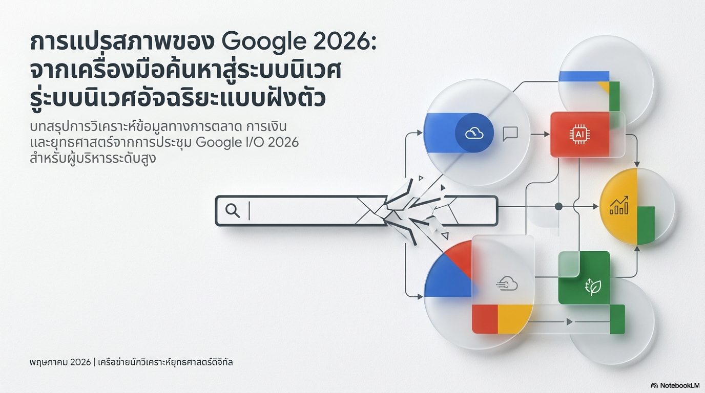
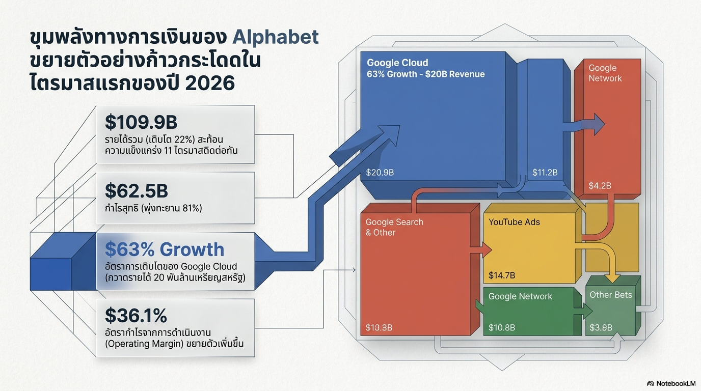
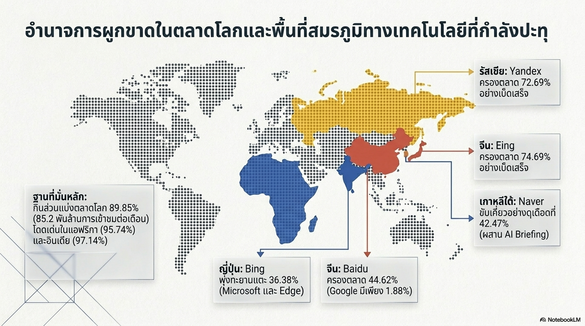
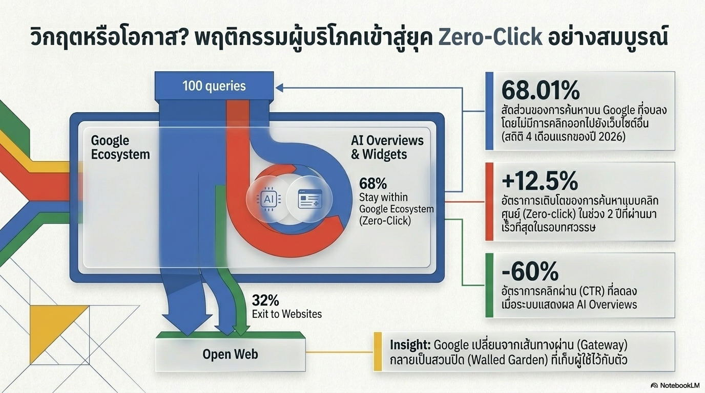
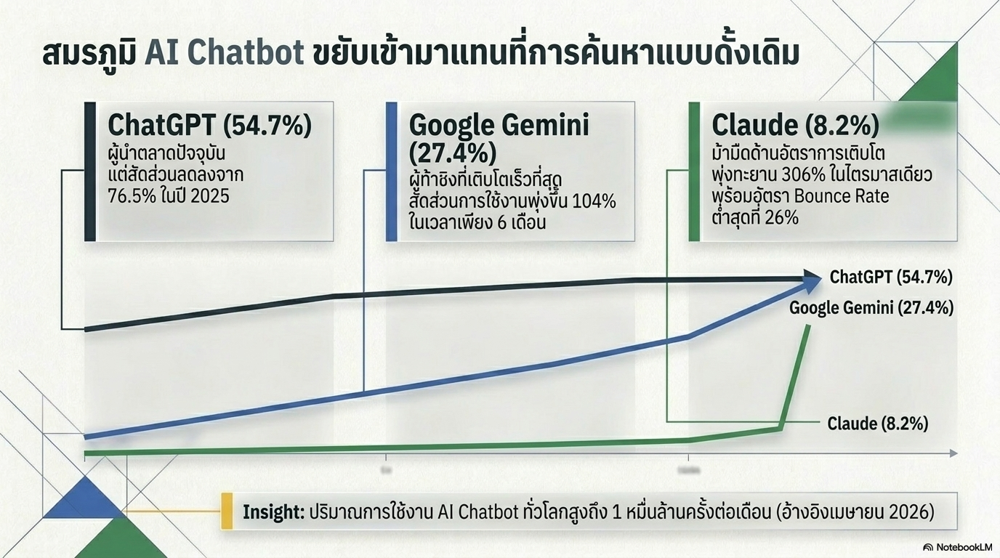
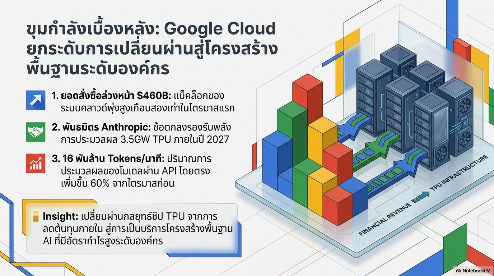
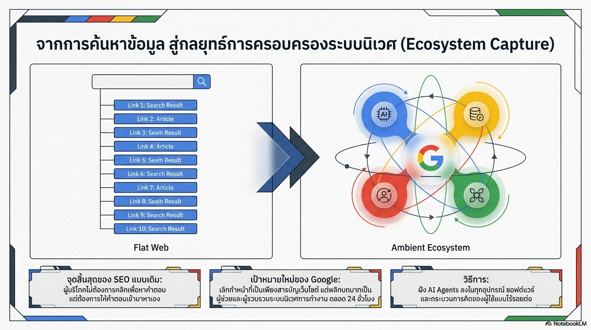
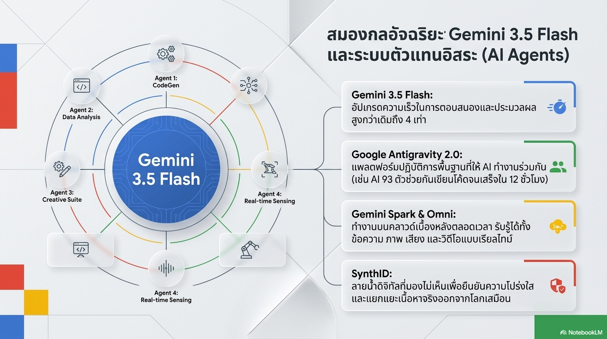
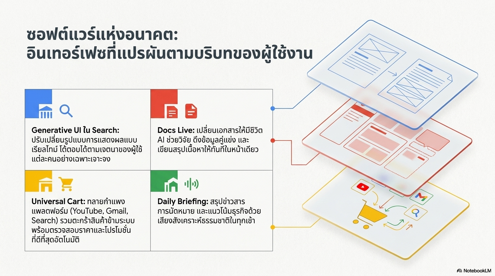
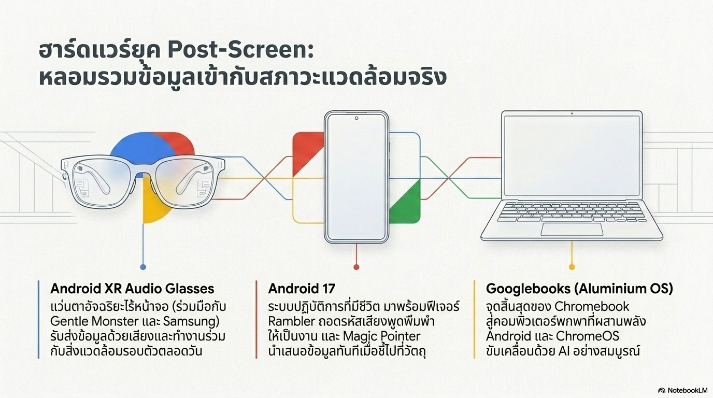
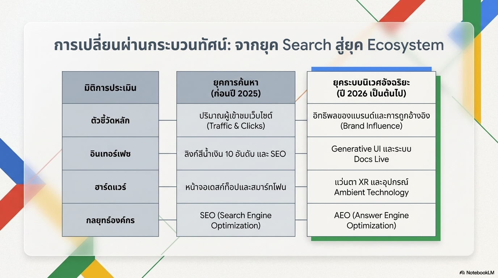
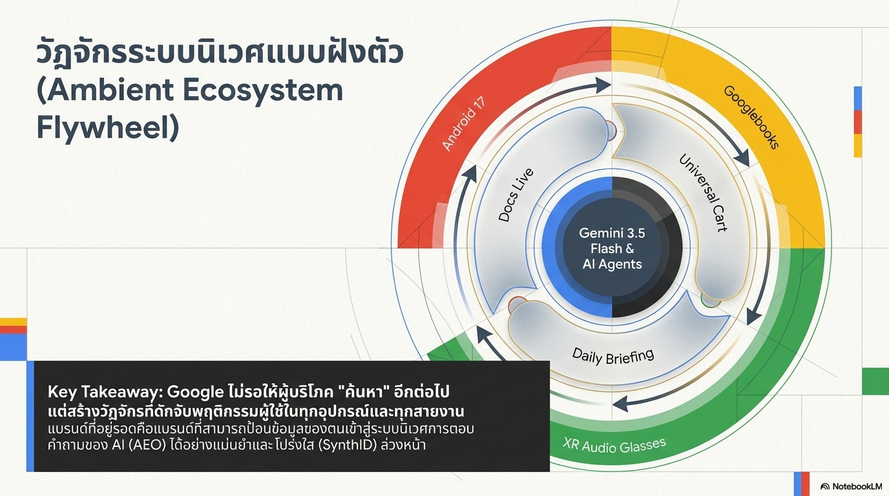

---

### สรุปประเด็นสำคัญ
- **จาก SEO → AEO**: ต้องทำให้ AI เลือกตอบ
- **Ecosystem Capture**: Gemini ฝังใน Android, Gmail, YouTube, Maps
- **Search Share**: Google ยังครอง 89.85%

สร้างโดย: [@omaew84-cpu](https://github.com/omaew84-cpu)
